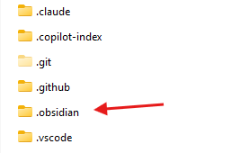
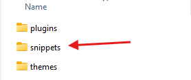
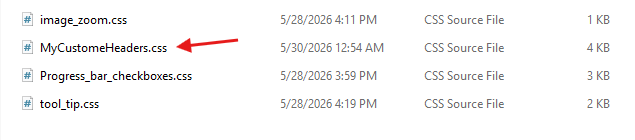
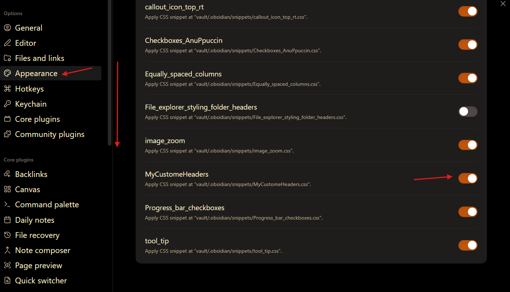
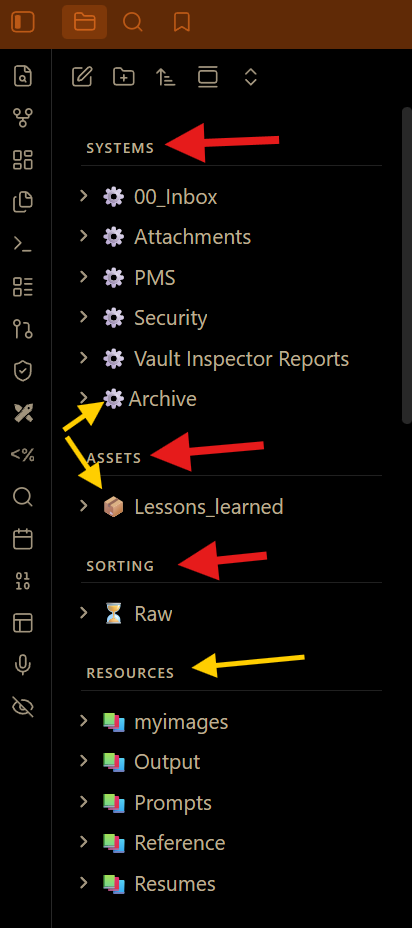

# Advanced Flex-Sorting Obsidian Folder Headers

An elegant, robust CSS layout solution for Obsidian v1.6.5+ that automatically injects visual structural headers above your folders and forces custom ordering without modifying alphabetical sorting behavior.

---

## 💡 The Core Problem & Solution

### The Old Fragile Method (`:nth-child`)
Traditional folder header snippets rely on structural counting selectors (`:nth-child`). The moment you add, rename, or rearrange *any* folder in your vault, the entire code breaks, scattering headers onto completely random folders.

### The Modern Flex-Sorting Method
This snippet uses **Attribute Selectors (`data-path`)** paired with a structural **Adjacent Sibling Combinator (`+`)**. It targets folder assignments dynamically by scanning the prefix icon inside the folder name. 

Furthermore, it overrides Obsidian's native alphabetical rendering tree using a flexbox container layout (`order`), allowing you to pin specific groupings into custom-ordered vertical zones.

---

## 🛠️ Folder Prefix Cheat-Sheet

To sort your folders into their respective headers, rename your vault folders to include the designated emoji at the **very front** of the folder title. 

The CSS script will automatically group, organize, and position them in this exact layout sequence:

| Pos | Section Header | Required Emoji Prefix | Folder Name Example |
| :--- | :--- | :---: | :--- |
| **1** | `SYSTEMS` | `⚙️` | `⚙️ Templates` / `⚙️ Plugins` |
| **2** | `PRIVATE` | `🔒` | `🔒 Journal` / `🔒 Finances` |
| **3** | `ASSETS` | `📦` | `📦 myimages` / `📦 Attachments` |
| **4** | `SORTING` | `⏳` | `⏳ 00_Inbox` / `⏳ Daily_Review` |
| **5** | `RESOURCES` | `📚` | `📚 Reference` / `📚 Scripts` |

---

## 📦 Features & Bug Fixes Included

* **Zero Duplication Glitch:** Standard CSS rules paint headers on *every* matching element. This snippet features isolation logic to ensure the header is drawn exactly once above the topmost folder of each cluster.
* **No Text Overlaps:** Eradicates the broken absolute positioning bug where long titles get slashed like a strikethrough. Folders drop down dynamically to give headings healthy vertical white space.
* **100% Graph-Safe:** Renaming folders to include emojis updates internal paths instantly in Obsidian. Your internal notes links, metadata indexes, search parameters, and Graph View lines will **not** break.

---

## 🚀 Installation & Setup Guide

### Step 1: Create the Snippet File
1. Create a blank plain text document on your machine using **Notepad** (Windows) or **TextEdit** (Mac).
2. Paste the source code from `advanced_flex_-sorting_obsidian_headers.css` inside that document.
3. Save the file under the exact name: `advanced_flex_-sorting_obsidian_headers.css` *(Ensure your system does not append a trailing `.txt` extension)*.

### Step 2: Import Into Obsidian Vault
1. Open your Obsidian Vault and navigate to **Settings ⚙️ > Appearance**.
2. Scroll to the bottom row labeled **CSS Snippets**.
3. Click the small **Folder Icon** button to reveal your machine's hidden system folder directory.
4. Drag and drop your saved `.css` snippet file directly into that open window.

### Step 3: Activate Layout
1. Return to your Obsidian Vault window.
2. Tap the circular **Reload snippets** arrow button.
3. Toggle the activation switch next to `advanced_flex_-sorting_obsidian_headers` to **ON**.
4. Rename your folders using the [Prefix Cheat-Sheet](#️-folder-prefix-cheat-sheet) to see your new layout sections snap instantly into order!

---

---
## 🤝 Contributing & Troubleshooting

### My Headers are repeating or out of order!
Ensure that Obsidian is set to its default alphabetical sorting view. If you manually rearrange folders or use sorting plugins alongside this snippet, layout flow issues may happen.

### Changing Themes
If your custom vault theme has deeply customized text dimensions, you can safely modify the values inside the `.nav-files-container .nav-folder::before` class to perfectly align the font scaling or border widths.

---

## 📄 License
This project is open-source and licensed under the [MIT License](LICENSE). Fell free to modify, adapt, or share it!
